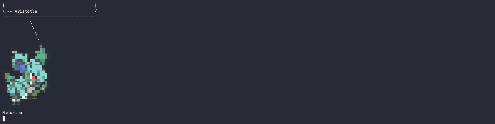
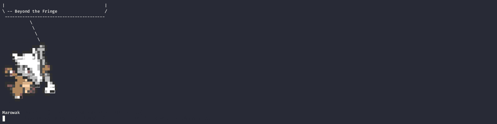

# Pintool3
pintool3 is an improved version of the pintool2.py script written by sebastiendamaye, available here (https://github.com/sebastiendamaye/pintool2).
I migrate it to python3, polish its coding style and improve it with new features.
This tool can be useful for solving some reversing challenges in CTFs events.
Implements the technique described here (http://shell-storm.org/blog/A-binary-analysis-count-me-if-you-can/). 

## Configuration
You must configure your `PINBASEPATH` inside the script:
```python
PINBASEPATH = 'change me'
PIN = PINBASEPATH + 'pin'
INSCOUNT32 = PINBASEPATH + 'source/tools/ManualExamples/obj-ia32/inscount0.so'
INSCOUNT64 = PINBASEPATH + 'source/tools/ManualExamples/obj-intel64/inscount0.so'
```

## Help
```sh
usage: pintool3.py [-h] [-e] [-l PASSLEN] [-c CHARNUM] [-b EXCHAR] [-a ARCH] [-i INITPASS] [-s SYMBFILL] [-d EXPRESSION] [-r] filename

positional arguments:
  filename       Program for playing with Pin Tool

options:
  -h, --help     show this help message and exit
  -e             Study the password length, for example -e -l 40, with 40 characters
  -l PASSLEN     Length of password (Default: 10 )
  -c CHARNUM     Charset definition for brute force (1-Lowercase, 2-Uppecase, 3-Numbers, 4-Hexadecimal, 5-Punctuation, 6-All)
  -b EXCHAR      Add characters for the charset, example -b _-
  -a ARCH        Program architecture 32 or 64 bits, -a 32 or -a 64
  -i INITPASS    Inicial password characters, example -i CTF{
  -s SYMBFILL    Symbol for complete all password (Default: _ )
  -d EXPRESSION  Difference between instructions that are successful or not (Default: != 0, example -d '== -12', -d '=> 900', -d '<= 17' or -d '!= 32')
  -r             Start in reverse order

Examples:
  ./pintool3.py -l 30 -c 1,2,3 -b _{} -s - -a 32 test/baleful
  ./pintool3.py -l 37 -c 4 -i CTF{ -b }_ -s - -a 32 -d '=> 1200' test/reverse400
  ./pintool3.py -c 1,2,3 -b _ -s - -l 28 -d '=> 6000' test/wyvern
  ./pintool3.py -r -l 32 -c 1,2,3 -b _{$} -s - 01f47d58806a8264cd4b2b97b9dabb4a
```

## Examples
**Baleful - picoCTF 2014**



**Reverse 400 - Hack You 2014**



**wyvern 500 - CSAW CTF 2015**


**rev100 - th3jackers CTF 2015**


```sh
$ ./pintool2.py -r -l 32 -c 1,2,3 -b _{$} -s - 01f47d58806a8264cd4b2b97b9dabb4a
```

License
----

MIT